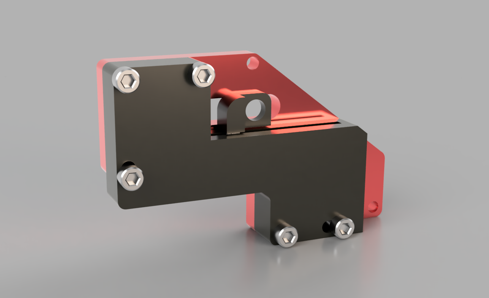
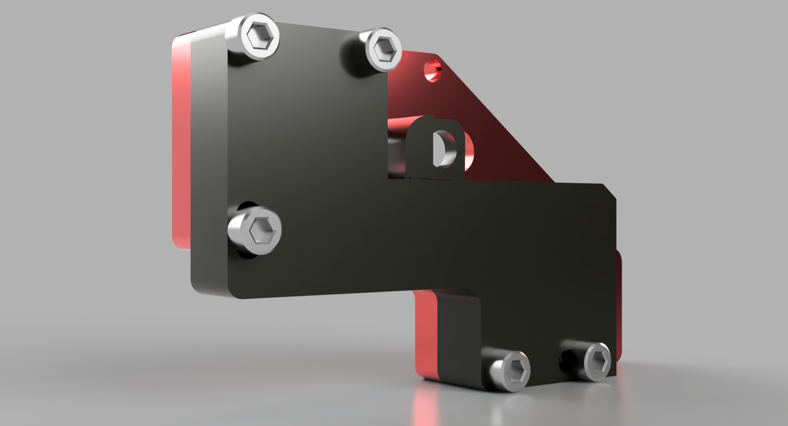
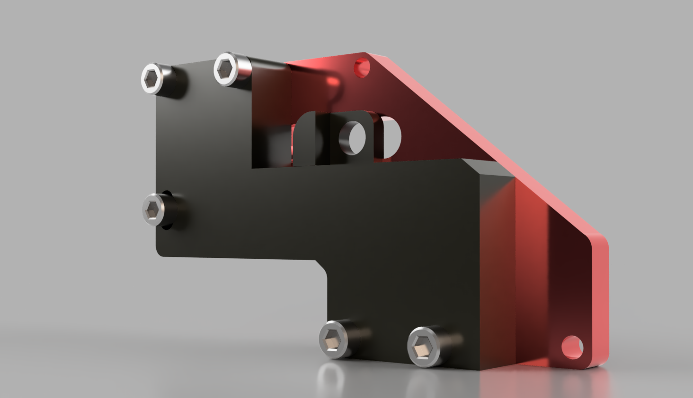

# **SIMRACING LINEAR HANDBRAKE** ❗ 

**Tags:** 

&nbsp;&nbsp;&nbsp;

&nbsp;&nbsp;&nbsp;&nbsp;&nbsp;&nbsp;&nbsp;&nbsp;&nbsp;

---

## **PROJECT DESCRIPTION:**

This project is a **DIY hardware project** and it's a *Linear Handbrake* used for **SimRacing**.

The project is basically a *MOD* for a **REAL hydraulic handbrake**, converting it into a linear analog signal **to be used for Simracing**.

The *purpose* of this project is to **improve immersion** while playing *Racing games* AND have *better control* of the car since **the handbrake signal can now be modulated.**

Having an **analog signal instead of pressing a button** is very gamechanging, because thanks to that **it is possible to manage the signal** in relation to its *curve, dead zone, linearity and saturation*.

Also **it ensures accuracy** and linearity when engaging the handbrake, as opposed to having a single button *that instantly shifts the signal from 0% to 100%*.

**The arduino Code is avaiable for free in the repository.**

[//]: # (Optional: year quarter month period)

  

### **Features**
- *Enhance* your racing experience and immersion with a **real handbrake** in your SimRig.
- The **linear signal** ensures *accuracy and linearity* when engaging the handbrake, as opposed to having a single button that *instantly shifts the signal from 0% to 100%*.
- Having a physical handbrake *helps ensure better accessibility than a simple button on the steering wheel* which can often be difficult to press while racing.
- **Customized management of the signal** in relation to its *curve, dead zone, linearity and saturation*.

## **Ratings**

**Difficulty:** &nbsp;&nbsp;&nbsp;&nbsp;&nbsp;&nbsp;&nbsp;&nbsp;&nbsp;&nbsp;&nbsp;&nbsp;&nbsp; 2/5  ⭐⭐⚫⚫⚫

**Parts needed:** &nbsp;&nbsp;&nbsp;&nbsp;&nbsp;&nbsp; 2/5  ⭐⭐⚫⚫⚫

**Cost:** &nbsp;&nbsp;&nbsp;&nbsp;&nbsp;&nbsp;&nbsp;&nbsp;&nbsp;&nbsp;&nbsp;&nbsp;&nbsp;&nbsp;&nbsp;&nbsp;&nbsp;&nbsp;&nbsp;&nbsp; 3/5  ⭐⭐⭐⚫⚫

**Usefulness:** &nbsp;&nbsp;&nbsp;&nbsp;&nbsp;&nbsp;&nbsp;&nbsp;&nbsp;&nbsp; 4/5  ⭐⭐⭐⭐⚫

**Time needed:** &nbsp;&nbsp;&nbsp;&nbsp;&nbsp;&nbsp; 2/5  ⭐⭐⚫⚫⚫

[//]: # (## REPORT)
[//]: # (Check the report in the repository if avaiable.)

---

## **3D MODELS IMAGES** 
[//]: # (if necessary)

### **CASE**

  
  

### **TOP & SLIDING CAP**

  
  
  

[//]: # (One or two images that contains multiple view of one or many 3D models)

[//]: # (Do you want to have it printed? Click Here.)

### **3D MODEL FILES:**

**All** 3D models files are **available for free** and *can be found in the repository.*

## **Wiring diagram** 
[//]: # (if necessary)

  

**Hardware components:**
- 1 x Arduino Pro Micro 
- 1 x Hydraulic Handbrake
- 1 x 10K Linear Potentiometer (60mm).
- 1 x 3D Printed Case *(Optional)*
- 5 x M5 bolt (Minimum 30 mm)

**Necessary tools:**
- Soldering Iron
- 3D Printer *(Optional)*
- Hot Glue Gun / SuperGlue

### **How to assemble it**

1. Wire the Arduino pins with the linear potentiometer according to the *Wiring Diagram*.
2. Fix the *Arduino Pro Micro* in the 3D printed case using Hot Glue or Super Glue.
3. Fix the *linear potentiometer* in the 3D printed case using Hot Glue or Super Glue.
4. Close the 3D printed case.
5. Fix the *linear potentiometer* **slider cap** with Hot Glue or Super Glue.
6. Lock the 3D printed case with the M5 bolts in the Hydraulic Handbrake frame.
7. Lock the *linear potentiometer slider cap* in the Hydraulic Handbrake frame **using the existing slide bolt**.
9. Download the latest **Arduino IDE** and **Arduino Drivers**.
10. Connect the Arduino to the PC using an USB cable.
11. Open **Arduino IDE** and *upload the code* **provided in the repository**.

### **ARDUINO CODE:**

The Arduino Code is **available for free** and *can be found in the repository.*

---

## **GALLERY:**

### **RENDER**

  

  
  

<!--
## **IRL (Project Completed)**

  

--!>
